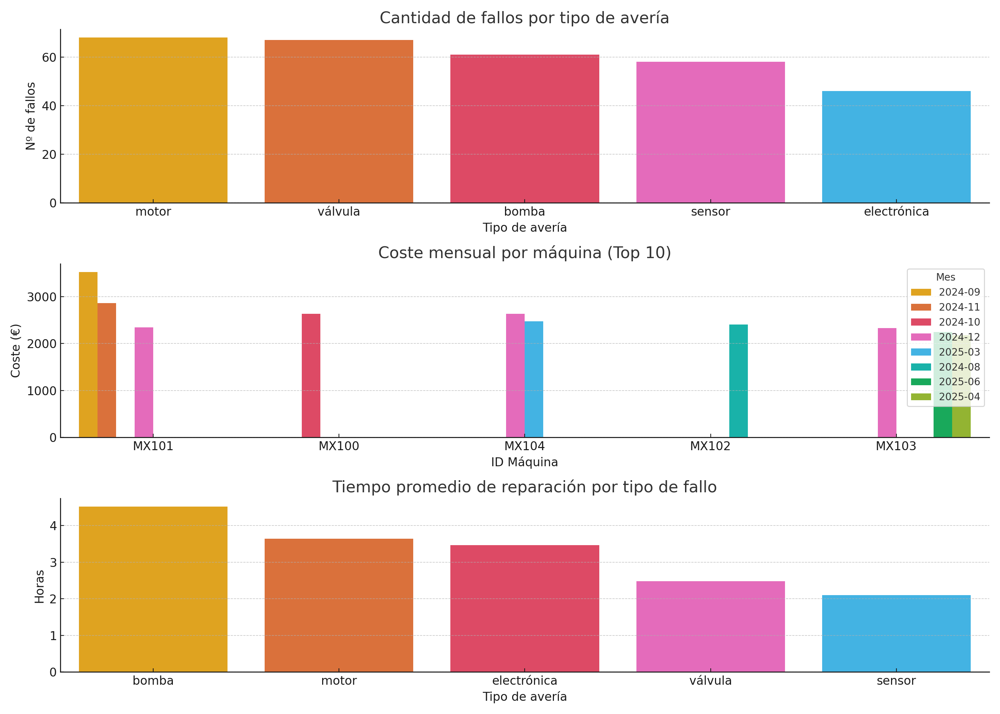

# 🔧 Análisis de Averías en Maquinaria Industrial


## 📌 Descripción

Este proyecto simula un entorno industrial con registros de averías en diferentes máquinas. A través de Python y análisis de datos, se responde a preguntas clave como:

- ¿Qué piezas fallan con más frecuencia?
- ¿Cuál es el coste mensual por máquina?
- ¿Qué tipo de avería tarda más en repararse?

---

## 🧰 Tecnologías utilizadas

- 🐍 Python 3.10
- 📊 Pandas y Numpy
- 📈 Matplotlib y Seaborn
- 📁 Jupyter Notebook
- 🧪 Scikit-learn (opcional para predicción)
- 📋 Archivos CSV como fuente de datos

---

## 📂 Estructura del proyecto


```
proyecto_averias_industriales/
├── data/
│   └── averias_simuladas.csv
├── notebooks/
├── img/
│   └── analisis_averias.png
└── README.md
```


---

## 📊 Ejemplos de análisis

### 🔸 ¿Qué piezas fallan más?

Se representa mediante un gráfico de barras agrupando el número de fallos por tipo de avería.

### 🔸 ¿Coste mensual por máquina?

Agrupación por `ID_Maquina` y mes para conocer qué máquinas generan más gasto.

### 🔸 ¿Tiempo promedio de reparación por fallo?

Media de duración de reparación por tipo de avería, útil para priorizar recursos y repuestos.



---

## 🚀 Cómo usar este proyecto

1. Clona el repositorio:
```bash
git clone https://github.com/tu_usuario/proyecto_averias_industriales.git


## Autor
Josep Oriol Escobar López
